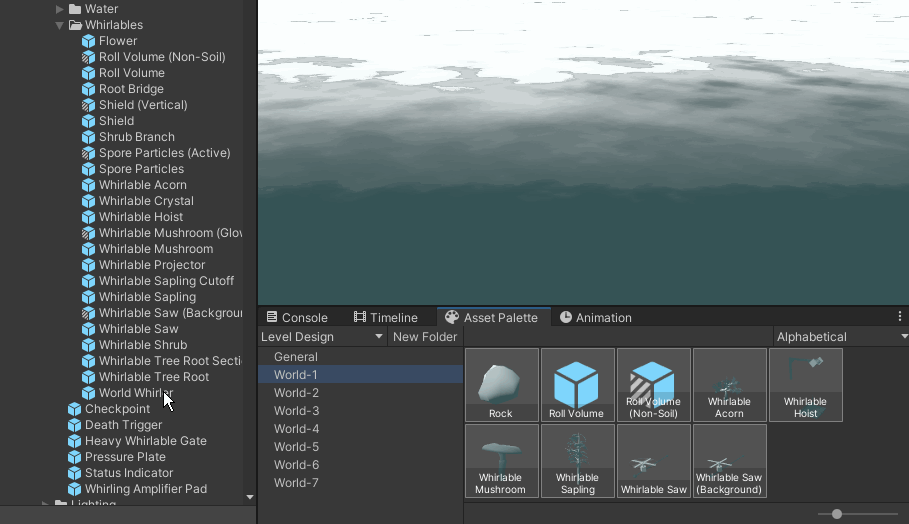

 

_Allows you to quickly organize assets for certain workflows, such as organizing prefabs for level design._

## About the Project

I noticed that during game development there are certain workflows - such as level design - where you are making heavy use of a very small group of assets, such as all the props that belong to the level you're currently designing. It doesn't always make sense to put those assets in the same folder in your project, sometimes you want to make custom groups of assets regardless of where the files are in your project.

That's exactly what this tool is for.

Make custom groups of frequently used assets and shortcuts to folders for your project-specific workflows.

## Getting Started

- Add the Asset Palette to your Unity project (tips on how to install it are in the Installation section)
- Open a new Asset Palette window via `Windows/General/Asset Palette`
- Create a new Asset Palette Collection asset. This is where your folders and asset shortcuts will be serialized to.

## Installation

This asset can be downloaded and added to the project, or ideally added to your project's Asset folder as a submodule.

## Contact
[Roy Theunissen](https://roytheunissen.com)

[roy.theunissen@live.nl](mailto:roy.theunissen@live.nl)
